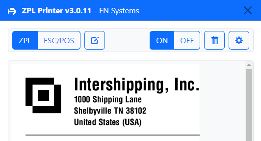
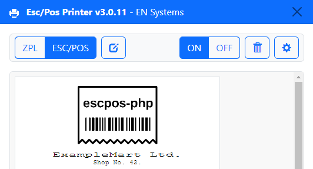

# Zpl - Esc/Pos Printer

Printer emulator for Zpl, Esc/Pos rendering engine. The emulator is based on the [labelary](http://labelary.com/service.html) web service.
You can configure print density, label size and the tcp server to listen for any incoming labels.

[Releases](https://github.com/erikn69/ZplEscPrinter/releases/latest)

## New in Version 3.0

The app now emulates Epson ESC/POS. The emulator is based on the [escpos-netprinter](https://github.com/gilbertfl/escpos-netprinter/blob/master/esc2html.php) repo by [@gilbertfl](https://github.com/gilbertfl)/[@mike42](https://github.com/mike42), and can be installed via the binaries/zips on the GitHub Releases page. It currently supports

* Windows:
  * Squarrel installer (zpl-escpos-printer-**version**-win32-**arch**-setup.exe)
  * Portable runner (zpl-escpos-printer-portable-**version**.exe)
  * NuGet package (zpl-escpos-printer-**version**-full.nupkg)
  * msi installer (TODO)
* Linux:
  * Rpm (zpl-escpos-printer-**version**.**arch**.rpm)
  * Deb (zpl-escpos-printer\_**version**\_**arch**.deb)
  * Zip (Zpl-EscPos.Printer-linux-**arch**-**version**.zip)
* Mac:
  * Zip (Zpl-EscPos.Printer-darwin-**arch**-**version**.zip)

## New in Version 2.0

The app now runs standalone via Electron.

## References
* [ZPL Command Support](http://labelary.com/docs.html)
* [ZPL Web Service](http://labelary.com/service.html)
* [Esc/Pos Commands](https://escpos.readthedocs.io/en/latest/commands.html)
* [Esc/Pos receipt print tools](https://github.com/receipt-print-hq/escpos-tools)
* [Electron](https://www.electronjs.org)
* [Electron Forge](https://www.electronforge.io)

## Release notes

### Version 3.0
* **Refactor** Reworked code
* **New** Esc/Pos Support
* **Fix** Bug fixes

### Version 2.2
* **Refactor** Reworked code
* **Upgrade** Bump dependencies

### Version 2.1
* **Refactor** Reworked entire app
* **Fix** Save labels
* **New** Support raw text file on save labels
* **New** Support pixels for width/height

### Version 2.0
* **Refactor** Reworked entire app to run in an Electron app instead of the Chrome Plugin API

### Version 1.6
* **Fix** PDF label export.
* **New** TCP input buffer size can be configure in settings.

### Version 1.5

* **New** Support to print multiple labels in one request.
* **New** Optional setting to keep tcp connection alive.

### Version 1.4.1

* **Fix** Minor fixes

### Version 1.4

* **New** Ability to save labels as image (PNG) or as PDF. (Thanks to [Derek Preston](https://plus.google.com/116997222122087717848/posts))

### Version 1.3

* **Change** Labelary web service call from GET to POST to support large ZPL templates. (Thanks to [pitufo](https://github.com/sbinkert/ZplPrinter/issues/1))

### Contributing

checkout the project. run `yarn install`. use `yarn start` to run in development mode and use `yarn make` to generate binaries for your OS

